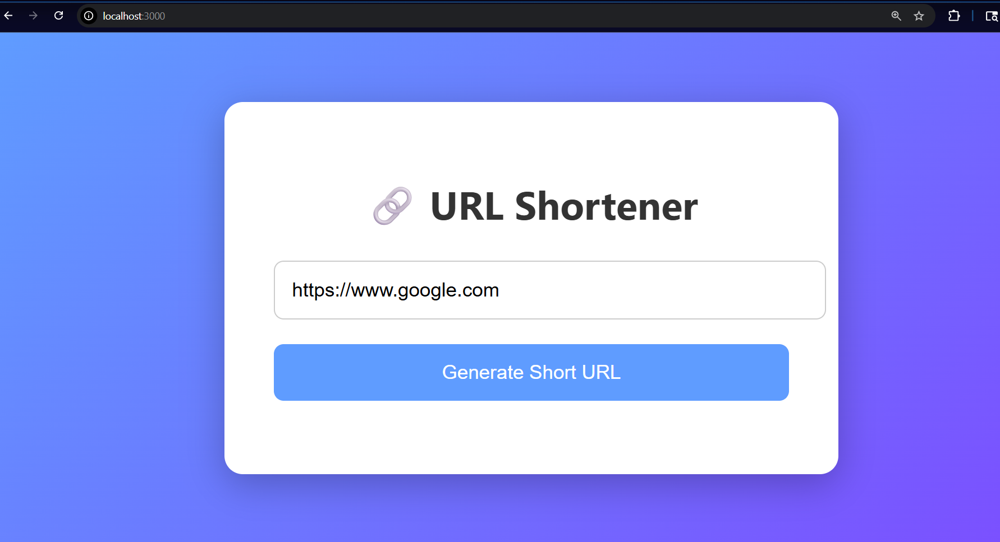

# URL Shortener - CodeAlpha Internship

This project is a URL Shortener backend built using Node.js, Express, and MySQL.

## Features
- Generate short URLs
- Store URLs in MySQL database
- Redirect short links to original URLs

## Technologies Used
- Node.js
- Express.js
- MySQL
- Postman

## How to Run the Project

1. Install dependencies
npm install

2. Run the server
node server.js

3. Test API using Postman

POST /shorten
{
 "originalUrl":"https://google.com"
}
## 📸 Project Preview

## Author
Siddhi Gandhi
